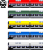
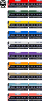

# OpenTTD YST set 자료실입니다.
## 저작권
 CC-BY-NC-SA v3.0 : 비영리조건이며, 스프라이트를 제공한 뒤엔 얼마든지 수정할 수 있습니다. 

## 컴퍼일
makefile, [nml0.6.1](https://github.com/OpenTTD/nml) 등의 최신버전을 사용합니다. 

## 자료활용
그동안 많은 발전을 주신 분들께 진심으로 감사올립니다. 
저작권 특성상 자유로운 변경공개이므로, 이미 공개된 자료에 대해선 얼마든지 수정하실 수 있습니다. 

## 자료공개
공식 : 일자별 최종본이 완성되면 공개합니다. 공개버전은 공개일이 1회로 제한하여 공개합니다. 
프리 : 코딩진행하면서 테스트로 만들어진 자료가 있을시, 선공개하는 방식입니다. 릴리즈의 pre-release로 공개됩니다. 
공개일 : 정해지지 않습니다. 공개되면 공개되었구나, 하며 넘어가십시오. 

## 자료제공
YST는 다소 까다로운 템플릿을 보유하고 보다 편한 코딩방식을 택하고 있습니다. 기본적인 템플릿은 순차적으로 만들겠습니다. 

# YST Set 열차 목록
## 개요
객차/화차는 2000번대, 열차는 3000번대, 지하철은 4000번대를 사용합니다.  
타 grf의 고유 ID를 사용시 열차고유 ID충돌로 YST 열차셋이 등장하지 않을 수도 있습니다. 
우선순위를 위해 grf목록의 YST를 상위로 올리시면 충돌할 일을 없습니다. 

## 최근 추가 열차

내용보기

<table>
	<thead>
		<tr>
			<th>구분</th><th>ID</th><th>열차이름</th><th>도입년도</th><th>열차속도</th><th>수송량</th>
		</tr>
	</thead>
	<tbody>
        	<tr>
			<td rowspan="4">일반열차</td>
		</tr>
		<tr>
			<td rowspan="3">3052</td>
		</tr>
		<tr>
			<td colspan="4"></td>
		</tr>
		<tr>
			<td>ITX-SM2 빨강도색</td><td>2020년</td><td>181km/h</td><td>운전차량 160, 객차차량 200</td>
		</tr>
		<!-- // ITX-SM2 빨강-->
		<tr>
			<td rowspan="4">일반열차</td>
		</tr>
		<tr>
			<td rowspan="3">3052</td>
		</tr>
		<tr>
			<td colspan="4"></td>
		</tr>
		<tr>
			<td>ITX-SM2 녹색도색</td><td>2020년</td><td>181km/h</td><td>운전차량 160, 객차차량 200</td>
		</tr>
		<!-- // ITX-SM2 녹색-->
		<tr>
			<td rowspan="4">일반열차</td>
		</tr>
		<tr>
			<td rowspan="3">3052</td>
		</tr>
		<tr>
			<td colspan="4"></td>
		</tr>
		<tr>
			<td>ITX-SM2 흰색도색</td><td>2020년</td><td>181km/h</td><td>운전차량 160, 객차차량 200</td>
		</tr>
		<!-- // ITX-SM2 흰색-->
		<tr>
			<td rowspan="4">고속열차</td>
		</tr>
		<tr>
			<td rowspan="3">3053</td>
		</tr>
		<tr>
			<td colspan="4"></td>
		</tr>
		<tr>
			<td>KTX-SC2 파랑도색</td><td>2020년</td><td>362km/h</td><td>객차차량 116</td>
		</tr>
		<!-- // KTX-SC2 파랑-->
		<tr>
			<td rowspan="4">고속열차</td>
		</tr>
		<tr>
			<td rowspan="3">3053</td>
		</tr>
		<tr>
			<td colspan="4"></td>
		</tr>
		<tr>
			<td>KTX-SC2 녹색도색</td><td>2020년</td><td>362km/h</td><td>객차차량 116</td>
		</tr>
		<!-- // KTX-SC2 녹색-->
		<tr>
			<td rowspan="4">고속열차</td>
		</tr>
		<tr>
			<td rowspan="3">3053</td>
		</tr>
		<tr>
			<td colspan="4"></td>
		</tr>
		<tr>
			<td>KTX-SC2 흰색도색</td><td>2020년</td><td>362km/h</td><td>객차차량 116</td>
		</tr>
		<!-- // KTX-SC2 흰색-->
        <tr>
			<td rowspan="4">일반열차</td>
		</tr>
		<tr>
			<td rowspan="3">3054</td>
		</tr>
		<tr>
			<td colspan="4"></td>
		</tr>
		<tr>
			<td>NRT2 파랑도색</td><td>2020년</td><td>181km/h</td><td>운전차량 160, 객차차량 116</td>
		</tr>
		<!-- // NRT2 파랑-->
        <tr>
			<td rowspan="4">일반열차</td>
		</tr>
		<tr>
			<td rowspan="3">3054</td>
		</tr>
		<tr>
			<td colspan="4"></td>
		</tr>
		<tr>
			<td>NRT2 녹색도색</td><td>2020년</td><td>181km/h</td><td>운전차량 160, 객차차량 116</td>
		</tr>
		<!-- // NRT2 녹색-->
        <tr>
			<td rowspan="4">일반열차</td>
		</tr>
		<tr>
			<td rowspan="3">3054</td>
		</tr>
		<tr>
			<td colspan="4"></td>
		</tr>
		<tr>
			<td>NRT2 흰색도색</td><td>2020년</td><td>181km/h</td><td>운전차량 160, 객차차량 116</td>
		</tr>
		<!-- // NRT2 흰색-->
</table>

## 열차목록
### 객차 & 화차

내용보기

<table>
    <thead>
        <tr>
            <th>열차<th>도입</th>
        </tr>
    </thead>
	<tbody>
		<tr>
			<td colspan="2">2001 : 1층 공통객차</td>
		</tr>
		<tr>
			<td></td><td>1978</td>
		</tr>
		<!-- // 2001-->
		<tr>
			<td colspan="2">2002 : 2층 공통객차</td>
		</tr>
		<tr>
			<td></td><td>2020</td>
		</tr>
		<!-- // 2002-->
		<tr>
			<td colspan="2">2003 : TGV Poste 화차</td>
		</tr>
		<tr>
			<td></td><td>1978</td>
		</tr>
		<!-- // 2003-->
		<tr>
			<td colspan="2">2004 : YFX용 화차</td>
		</tr>
		<tr>
			<td></td><td>2020</td>
		</tr>
		<!-- // 2004-->
		<tr>
			<td colspan="2">2005 : 평판화차</td>
		</tr>
		<tr>
			<td></td><td>1967</td>
		</tr>
		<!-- // 2005-->
		<tr>
			<td colspan="2">2006 : 평판화차 - 미국형</td>
		</tr>
		<tr>
			<td></td><td>1967</td>
		</tr>
		<!-- // 2006-->
		<tr>
			<td colspan="2">2007 : 평판유조 화차</td>
		</tr>
		<tr>
			<td></td><td>1967</td>
		</tr>
		<!-- // 2007-->
		<tr>
			<td colspan="2">2008 : 유조차</td>
		</tr>
		<tr>
			<td></td><td>1967</td>
		</tr>
		<!-- // 2008-->
		<tr>
			<td colspan="2">2009 : YPW 1층 객차</td>
		</tr>
		<tr>
			<td></td><td>1967</td>
		</tr>
		<!-- // 2009-->
		<tr>
			<td colspan="2">2010 : YPW 2층 객차</td>
		</tr>
		<tr>
			<td></td><td>2020</td>
		</tr>
		<!-- // 2010-->
		<tr>
			<td colspan="2">2011 : YPW 침대차</td>
		</tr>
		<tr>
			<td></td><td>1967</td>
		</tr>
		<!-- // 2011-->
		<tr>
			<td colspan="2">2012 : YPW 발전차</td>
		</tr>
		<tr>
			<td></td><td>1967</td>
		</tr>
		<!-- // 2012-->
		<tr>
			<td colspan="2">2013 : YPW 수화물차</td>
		</tr>
		<tr>
			<td></td><td>1967</td>
		</tr>
		<!-- // 2013-->
		<tr>
			<td colspan="2">2014 : (예정) 무궁화 2층객차</td>
		</tr>
		<tr>
			<td></td><td>2020</td>
		</tr>
		<!-- // 2014-->
	</tbody>
</table>

### 일반열차, 기관차, 고속열차

내용보기

<table>
    <thead>
        <tr>
            <th>열차<th>도입</th><th>열차속도</th>
        </tr>
    </thead>
	<tbody>
		<tr>
			<td colspan="3">3001 : AGV</td>
		</tr>
		<tr>
			<td></td><td>2012</td><td>362km/h</td>
		</tr>
		<!-- // 3001-->
		<tr>
			<td colspan="3">3002 : AGV Cool</td>
		</tr>
		<tr>
			<td></td><td>2020</td><td>430km/h</td>
		</tr>
		<!-- // 3002-->
		<tr>
			<td colspan="3">3003 : AVE</td>
		</tr>
		<tr>
			<td></td><td>2012</td><td>362km/h</td>
		</tr>
		<!-- // 3003-->
		<tr>
			<td colspan="3">3004 : AVE Velaro</td>
		</tr>
		<tr>
			<td></td><td>2006</td><td>362km/h</td>
		</tr>
		<!-- // 3004-->
		<tr>
			<td colspan="3">3005 : BB15048</td>
		</tr>
		<tr>
			<td></td><td>1971</td><td>181km/h</td>
		</tr>
		<!-- // 3005-->
		<tr>
			<td colspan="3">3006 : CRH1</td>
		</tr>
		<tr>
			<td></td><td>2007</td><td>260km/h</td>
		</tr>
		<!-- // 3006-->
		<tr>
			<td colspan="3">3007 : CRH3</td>
		</tr>
		<tr>
			<td></td><td>2017</td><td>362km/h</td>
		</tr>
		<!-- // 3007-->
		<tr>
			<td colspan="3">3008 : CRH362A</td>
		</tr>
		<tr>
			<td></td><td>2017</td><td>362km/h</td>
		</tr>
		<!-- // 3008-->
		<tr>
			<td colspan="3">3009 : CRH430A</td>
		</tr>
		<tr>
			<td></td><td>2017</td><td>430km/h</td>
		</tr>
		<!-- // 3009-->
		<tr>
			<td colspan="3">3010 : CRH600A-Test</td>
		</tr>
		<tr>
			<td></td><td>2017</td><td>600km/h</td>
		</tr>
		<!-- // 3010-->
		<tr>
			<td colspan="3">3011 : CRV600</td>
		</tr>
		<tr>
			<td></td><td>2012</td><td>600km/h</td>
		</tr>
		<!-- // 3011-->
		<tr>
			<td colspan="3">3012 : Dr. Yellow</td>
		</tr>
		<tr>
			<td></td><td>2007</td><td>600km/h</td>
		</tr>
		<!-- // 3012-->
		<tr>
			<td colspan="3">3013 : E300</td>
		</tr>
		<tr>
			<td></td><td>1992</td><td>362km/h</td>
		</tr>
		<!-- // 3013-->
		<tr>
			<td colspan="3">3014 : E320</td>
		</tr>
		<tr>
			<td></td><td>2014</td><td>362km/h</td>
		</tr>
		<!-- // 3014-->
		<tr>
			<td colspan="3">3015 : EMU260</td>
		</tr>
		<tr>
			<td></td><td>2020</td><td>260km/h</td>
		</tr>
		<!-- // 3015-->
		<tr>
			<td colspan="3">3016 : Glory 600</td>
		</tr>
		<tr>
			<td></td><td>2020</td><td>600km/h</td>
		</tr>
		<!-- // 3016-->
		<tr>
			<td colspan="3">3017 : GT26CW</td>
		</tr>
		<tr>
			<td></td><td>1967</td><td>181km/h</td>
		</tr>
		<!-- // 3017-->
		<tr>
			<td colspan="3">3018 : HEMU-430</td>
		</tr>
		<tr>
			<td></td><td>2007</td><td>430km/h</td>
		</tr>
		<!-- // 3018-->
		<tr>
			<td colspan="3">3019 : HMX</td>
		</tr>
		<tr>
			<td></td><td>2020</td><td>260km/h</td>
		</tr>
		<!-- // 3019-->
		<tr>
			<td colspan="3">3020 : ICE-SP</td>
		</tr>
		<tr>
			<td></td><td>2020</td><td>362km/h</td>
		</tr>
		<!-- // 3020-->
		<tr>
			<td colspan="3">3021 : ICE3</td>
		</tr>
		<tr>
			<td></td><td>1997</td><td>362km/h</td>
		</tr>
		<!-- // 3021-->
		<tr>
			<td colspan="3">3022 : KTX-N</td>
		</tr>
		<tr>
			<td></td><td>2020</td><td>362km/h</td>
		</tr>
		<!-- // 3022-->
		<tr>
			<td colspan="3">3023 : NJ2</td>
		</tr>
		<tr>
			<td></td><td>2006</td><td>181km/h</td>
		</tr>
		<!-- // 3023-->
		<tr>
			<td colspan="3">3024 : NKX</td>
		</tr>
		<tr>
			<td></td><td>2020</td><td>181km/h</td>
		</tr>
		<!-- // 3024-->
		<tr>
			<td colspan="3">3025 : 신칸센 500계</td>
		</tr>
		<tr>
			<td></td><td>1996</td><td>362km/h</td>
		</tr>
		<!-- // 3025-->
		<tr>
			<td colspan="3">3026 : 신칸센 500계 Cool</td>
		</tr>
		<tr>
			<td></td><td>2020</td><td>430km/h</td>
		</tr>
		<!-- // 3026-->
		<tr>
			<td colspan="3">3027 : 신칸센 500계 SP</td>
		</tr>
		<tr>
			<td></td><td>2020</td><td>362km/h</td>
		</tr>
		<!-- // 3027-->
		<tr>
			<td colspan="3">3028 : 신칸센 800계</td>
		</tr>
		<tr>
			<td></td><td>1996</td><td>260km/h</td>
		</tr>
		<!-- // 3028-->
		<tr>
			<td colspan="3">3029 : 신칸센 E5</td>
		</tr>
		<tr>
			<td></td><td>2011</td><td>362km/h</td>
		</tr>
		<!-- // 3029-->
		<tr>
			<td colspan="3">3030 : 신칸센 E6</td>
		</tr>
		<tr>
			<td></td><td>2011</td><td>362km/h</td>
		</tr>
		<!-- // 3030-->
		<tr>
			<td colspan="3">3031 : 신칸센 E7</td>
		</tr>
		<tr>
			<td></td><td>2014</td><td>362km/h</td>
		</tr>
		<!-- // 3031-->
		<tr>
			<td colspan="3">3032 : 신칸센 N700</td>
		</tr>
		<tr>
			<td></td><td>2007</td><td>362km/h</td>
		</tr>
		<!-- // 3032-->
		<tr>
			<td colspan="3">3033 : TAE</td>
		</tr>
		<tr>
			<td></td><td>2020</td><td>181km/h</td>
		</tr>
		<!-- // 3033-->
		<tr>
			<td colspan="3">3033 : TAE</td>
		</tr>
		<tr>
			<td></td><td>2020</td><td>260km/h</td>
		</tr>
		<!-- // 3033-->
		<tr>
			<td colspan="3">3034 : Talgo250</td>
		</tr>
		<tr>
			<td></td><td>2012</td><td>260km/h</td>
		</tr>
		<!-- // 3034-->
		<tr>
			<td colspan="3">3035 : TGV Duplex</td>
		</tr>
		<tr>
			<td></td><td>1994</td><td>362km/h</td>
		</tr>
		<!-- // 3035-->
		<tr>
			<td colspan="3">3036 : TGV Old</td>
		</tr>
		<tr>
			<td></td><td>1978</td><td>362km/h</td>
		</tr>
		<!-- // 3036-->
		<tr>
			<td colspan="3">3037 : TGV Old Duplex</td>
		</tr>
		<tr>
			<td></td><td>1994</td><td>362km/h</td>
		</tr>
		<!-- // 3037-->
		<tr>
			<td colspan="3">3038 : TGV Old Pos</td>
		</tr>
		<tr>
			<td></td><td>1978</td><td>362km/h</td>
		</tr>
		<!-- // 3038-->
		<tr>
			<td colspan="3">3039 : TGV Old Poste</td>
		</tr>
		<tr>
			<td></td><td>1978</td><td>362km/h</td>
		</tr>
		<!-- // 3039-->
		<tr>
			<td colspan="3">3040 : TGV Ouigo</td>
		</tr>
		<tr>
			<td></td><td>2013</td><td>362km/h</td>
		</tr>
		<!-- // 3040-->
		<tr>
			<td colspan="3">3041 : TGV Pos</td>
		</tr>
		<tr>
			<td></td><td>2006</td><td>362km/h</td>
		</tr>
		<!-- // 3041-->
		<tr>
			<td colspan="3">3042 : TGV Pos Poste</td>
		</tr>
		<tr>
			<td></td><td>2006</td><td>362km/h</td>
		</tr>
		<!-- // 3042-->
		<tr>
			<td colspan="3">3043 : THRS</td>
		</tr>
		<tr>
			<td></td><td>2007</td><td>362km/h</td>
		</tr>
		<!-- // 3043-->
		<tr>
			<td colspan="3">3044 : VTX</td>
		</tr>
		<tr>
			<td></td><td>2020</td><td>600km/h</td>
		</tr>
		<!-- // 3044-->
		<tr>
			<td colspan="3">3045 : YFX</td>
		</tr>
		<tr>
			<td></td><td>2020</td><td>600km/h</td>
		</tr>
		<!-- // 3045-->
		<tr>
			<td colspan="3">3046 : YTX</td>
		</tr>
		<tr>
			<td></td><td>2020</td><td>362km/h</td>
		</tr>
		<!-- // 3046-->
		<tr>
			<td colspan="3">3047 : ZEFIRO380</td>
		</tr>
		<tr>
			<td></td><td>2014</td><td>380km/h</td>
		</tr>
		<!-- // 3047-->
		<tr>
			<td colspan="3">3048 : ZEFIRO380 Black</td>
		</tr>
		<tr>
			<td></td><td>2020</td><td>600km/h</td>
		</tr>
		<!-- // 3048-->
		<tr>
			<td colspan="3">3049 : ZEFIRO380 Cool</td>
		</tr>
		<tr>
			<td></td><td>2020</td><td>430km/h</td>
		</tr>
		<!-- // 3049-->
		<tr>
			<td colspan="3">3050 : EMU362</td>
		</tr>
		<tr>
			<td></td><td>2020</td><td>362km/h</td>
		</tr>
		<!-- // 3050-->
		<tr>
			<td colspan="3">3051 : EMU180</td>
		</tr>
		<tr>
			<td></td><td>2023</td><td>181km/h</td>
		</tr>
		<!-- // 3051-->
		<tr>
			<td colspan="3">3052 : ITX-SM2</td>
		</tr>
		<tr>
			<td></td><td>2020</td><td>181km/h</td>
		</tr>
		<!-- // 3052-->
		<tr>
			<td colspan="3">3053 : KTX-SC2</td>
		</tr>
		<tr>
			<td></td><td>2020</td><td>362km/h</td>
		</tr>
		<!-- // 3053-->
		<tr>
			<td colspan="3">3054 : NRT2</td>
		</tr>
		<tr>
			<td></td><td>2020</td><td>181km/h</td>
		</tr>
		<!-- // 3054-->
	</tbody>
</table>

### 지하철

내용보기

<table>
    <thead>
        <tr>
            <th>열차<th>도입</th><th>열차속도</th>
        </tr>
    </thead>
	<tbody>
		<tr>
			<td colspan="3">4001 : MTR AD Tranz CAF A형</td>
		</tr>
		<tr>
			<td></td><td>1979</td><td>120km/h</td>
		</tr>
		<!-- // 4001-->
		<tr>
			<td colspan="3">4002 : MTR 메트로카멜 교류형 전동차</td>
		</tr>
		<tr>
			<td></td><td>1979</td><td>120km/h</td>
		</tr>
		<!-- // 4002-->
		<tr>
			<td colspan="3">4003 : MTR 메트로카멜 직류형 전동차</td>
		</tr>
		<tr>
			<td></td><td>1979</td><td>120km/h</td>
		</tr>
		<!-- // 4003-->
		<tr>
			<td colspan="3">4004 : MTR CNR 창춘 전동차</td>
		</tr>
		<tr>
			<td></td><td>1979</td><td>120km/h</td>
		</tr>
		<!-- // 4004-->
		<tr>
			<td colspan="3">4005 : MTR CRRC 전동차</td>
		</tr>
		<tr>
			<td></td><td>1979</td><td>120km/h</td>
		</tr>
		<!-- // 4005-->
		<tr>
			<td colspan="3">4006 : MTR 현대로템 미쓰비시 전동차</td>
		</tr>
		<tr>
			<td></td><td>1979</td><td>120km/h</td>
		</tr>
		<!-- // 4006-->
		<tr>
			<td colspan="3">4007 : MTR 현대로템 R형 전동차</td>
		</tr>
		<tr>
			<td></td><td>1979</td><td>120km/h</td>
		</tr>
		<!-- // 4007-->
		<tr>
			<td colspan="3">4008 : MTR IKK SP 1900</td>
		</tr>
		<tr>
			<td></td><td>1979</td><td>120km/h</td>
		</tr>
		<!-- // 4008-->
		<tr>
			<td colspan="3">4009 : YMT 100</td>
		</tr>
		<tr>
			<td></td><td>2020</td><td>120km/h</td>
		</tr>
		<!-- // 4009-->
		<tr>
			<td colspan="3">4010 : YMT 200</td>
		</tr>
		<tr>
			<td></td><td>2020</td><td>120km/h</td>
		</tr>
		<!-- // 4010-->
	</tbody>
</table>

